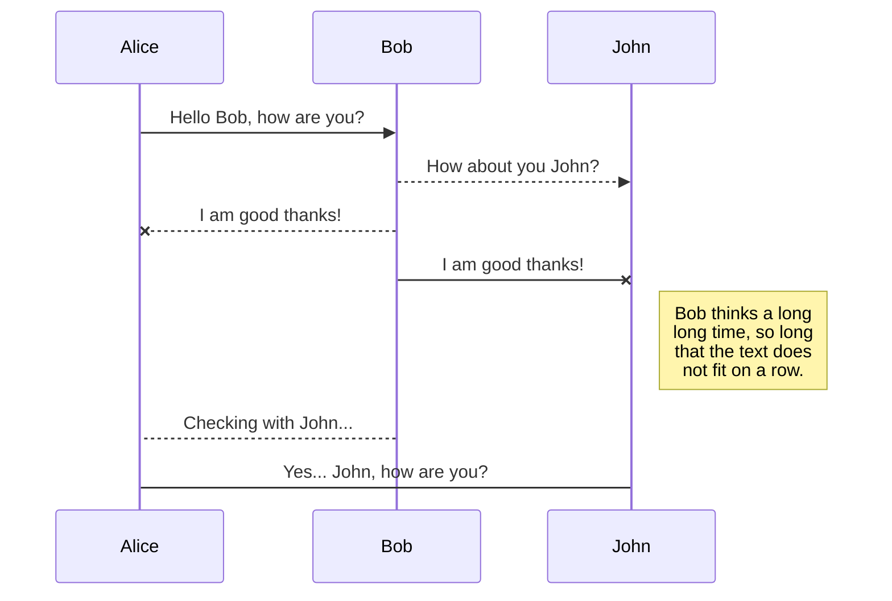
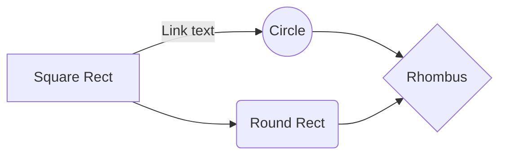
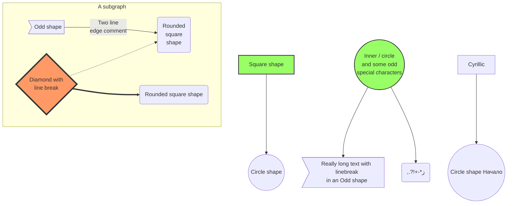
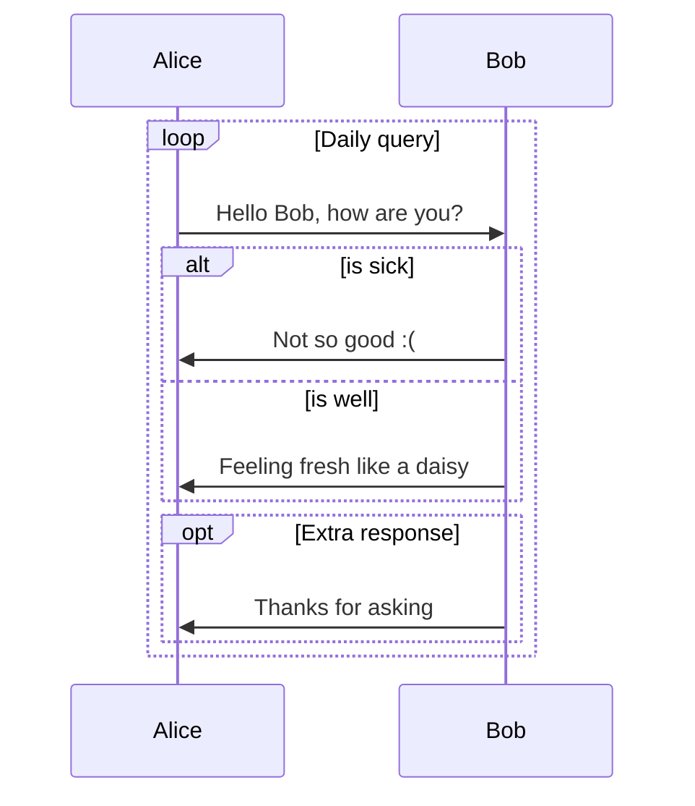

---
title: JAVA
commentable: true
Edit: 2023-2-21
mathjax: true
mermaid: true
status: Writing
tags: java nku-sms
categories: CS
description: This is my learning shares of JAVA course given by Pr. Xiang sms, Nankai University, in 2023 spring semester.
--- 

# Array Copy

In last week's class, a funny issue was left by Pr.Xiang, consider and compare several array copy methods in JAVA. 

I am always interested in the questions like this. Cause I'm interested in the underlying performance of a programming language and love to make comparisons to see whether my approach is good or not.

In this post we will try four methods of array copying in JAVA: 

1. The `copyOf()` method of the `Arrays class`
2. The `copyOfRange()` method of the `Arrays class`
3. The `arraycopy()` method of the `System class`
4. The `clone()` method of the `Object class`

## `copyOf()` Method and `copyOfRange()` Method

Both methods can achieve array copying. 

However, the `copyOf()` method copies an array to a specified length. The `copyOfRange()` method copies the specified length of the specified array into a new array.

### Using `copyOf()` Method

The syntax of the copyOf() method of the Arrays class is as follows:

```java
 Arrays.copyOf(dataType[] srcArray,int length);
```

Where `srcArray` represents the array to be copied, and `length` represents the length of the new array after copying.

When copying an array using this method, the default copy starts from the first element of the original array (index value 0), and the length of the destination array will be length.

If `length` is greater than `srcArray.length`, the target array is filled with default values; if length is less than srcArray.length, it is copied to the length element (index value length-1).

**Notice**: <u>The target array will be refactored if it already exists.</u>

> __Example 1.1__
>
> Suppose you have 5 grades in an array, and now you need to save those 5 grades in a new array, leaving 3 spare elements for later development.
>
> The code to complete the array copy using the `CopyOf()` method of the `Arrays class` is as follows:

```java
 import java.util.Arrays;
 public class Test19{
   public static void main(String[] args) {
       // 定义长度为 5 的数组
       int scores[] = new int[]{57,81,68,75,91};

       // 输出原数组
       System.out.println("原数组内容如下：");

       // 循环遍历原数组
       for(int i=0;i<scores.length;i++) {

       // 将数组元素输出
           System.out.print(scores[i]+"\t");
       }

       // 定义一个新的数组，将 scores 数组中的 5 个元素复制过来
       // 同时留 3 个内存空间供以后开发使用
       int[] newScores = (int[])Arrays.copyOf(scores,8);
       System.out.println("\n复制的新数组内容如下：");

       // 循环遍历复制后的新数组
       for(int j=0;j<newScores.length;j++) {
           // 将新数组的元素输出
           System.out.print(newScores[j]+"\t");
        }
    }
}
```

In the above code, since the length of the original array `scores` is 5, but the length of the new array `newScores` to be copied is 8, after the 5 elements in the original array are copied, the contents of the remaining 3 elements are filled with default values.

Because the data type of the original array `scores` is int, and the array is returned after copying the array using the `Arrays.copyOf(scores,8)` method, you need to cast the `Object[]` data type to `int[]` type. Also, because the data type of `scores` is int, the default value is 0.

The result of the run is shown below:

```markdown
原数组内容如下：
57    81    68    75    91   
复制的新数组内容如下：
57    81    68    75    91    0    0    0
```

### Using `copyOfRange()` Method

The `CopyOfRange()` method of the `Arrays class` is another way to copy an array with the following syntax:

```java
 Arrays.copyOfRange(dataType[] srcArray,int startIndex,int endIndex);
```

Thereinto:

- `srcArray` : the original array.

- `startIndex` : the starting index at which replication begins, the target array will contain the elements corresponding to the starting index, and the `startIndex` must be between 0 and `srcArray.length`.

- `endIndex` : the end index, the target array will not contain the elements corresponding to the end index, `endIndex` must be greater than or equal to `startIndex`, can be greater than `srcArray.length`, if greater than `srcArray.length`, the target array is populated with default values.

**Notice**: <u>The target array will be refactored if it already exists.</u>


> __Example 1.2__
>
> Suppose you have an array named `scores` with 8 elements, and now you need to define a new array named `newScores`. The elements of the new array are the first 5 elements of the `scores` array and do not change the order.
>
> The code to complete the array copy using the `copyOfRange()` method of the `Arrays class` is as follows:

```java
public class Test20 {
    public static void main(String[] args) {
        // 定义长度为8的数组
        int scores[] = new int[] { 57, 81, 68, 75, 91, 66, 75, 84 };
        System.out.println("原数组内容如下：");

        // 循环遍历原数组
        for (int i = 0; i < scores.length; i++) {
            System.out.print(scores[i] + "\t");
        }

        // 复制原数组的前5个元素到newScores数组中
        int newScores[] = (int[]) Arrays.copyOfRange(scores, 0, 5);
        System.out.println("\n复制的新数组内容如下：");

        // 循环遍历目标数组，即复制后的新数组
        for (int j = 0; j < newScores.length; j++) {
            System.out.print(newScores[j] + "\t");
        }
    }
}
```
In the above code, the original array scores contains 8 elements, use the Arrays.copyOfRange() method to copy the array into the newScores array of length 5, and intercept the first 5 elements of the scores array.

The result of the run is shown below:

```markdown
原数组内容如下：
57    81    68    75    91    66    75    84   
复制的新数组内容如下：
57    81    68    75    91
```

## `arraycopy()` Method

The `arraycopy()` method is located in the `java.lang.System class` and has the following syntax:

```java
 System.arraycopy(dataType[] srcArray,int srcIndex,int destArray,int destIndex,int length);
```

Thereinto:

- `srcArray` : the original array;

- `destArray` : the target array; 

- `srcIndex` : the starting index in the original array; 

- `destIndex` : the starting index in the target array; 

- `length` : the length of the array to copy.

When copying an array using this method, `length+srcIndex` must be less than or equal to `srcArray.length`, and `length+destIndex` must be less than or equal to `destArray.length`.

**Note**: <u>The target array must already exist and not be reconstructed, equivalent to replacing some elements in the target array<\u>.

# Highlights

*This is italic.* **This is Bold**. * If asterisk is surrounded by spaces, it is not parsed. *

_This is also italic._ __This is also Bold__. _ If underscore is surrounded by spaces, it is not parsed. _

~~This is strike through~~. 

There is no underline in markdown. You can use html tags <u>like this to underline.</u>

`This is a code block`. 

[This is an external link](https://bit.ly). "https://" is important. This is an internal [link](#this-is-a-h2). Internal links are all lowercase with space replaced by hyphens "-". 

You can mix them like [*this*](https://bit.ly), [`this`](https://bit.ly), **[this](https://bit.ly)**, but not like `[this](https://bit.ly)`.


# Other Elements

This is horizontal line

------

# Math Blocks

This is inline math $\sum_{i=1}^{N} i $. This is display math.
$$
\sum_{i=1}^{N} i 
$$
The extra empty line matters, or you will end up with
$$
\sum_{i=1}^{N} i
$$
[Mathjax](http://docs.mathjax.org/en/latest/tex.html) syntax is like latex. You cannot use `\usepackge`, but you can use `\newcommand` like this 
$$
\newcommand{\NewOp}[2]{\lbrace{#1}\mid \otimes{#2}\rbrace}
$$
And `\NewOp` will be available in all later math blocks, whether inline $\NewOp{x}{y}$ or display
$$
\NewOp{x}{y}
$$
Be **very careful** with the vertical bar symbol and underscore in math. If you use it like $|x|\ge 0$, $|0|=0$, or like $\lbrace x | x\gt 0\rbrace$, you will get a bunch of gibberish.

Use `\vert` in $\vert x\vert\ge 0$, $\vert 0\vert=0$. Use `\mid` in $\lbrace x \mid x\gt 0$ instead.

Also using underscores like this $x_1$, $x_2$, $x_{c_2}^{c_3}$, with $y_{c_2}^{c_3}$, will be processed as _this_.

Wrap underscores with whitespaces like this $x _ 1$, $x _ 2$, $x _ {c _ 2}^{c _ 3}$, with $y _ {c _ 2}^{c _ 3 }$.

# Images

Markdown uses `` to reference pictures, caption is optional. You cannot control the size. 


So I prefer using HTML tags like this:


# Lists

- This is unordered list
  - sub item
    - subsub item
      - subsubsub item
        - subsubsubsub ...

------


1. This ordered list
   1. sub item
2. This is as well
3. It can keep going

------

1. You can avoid numbers like this
   1. sub item
1. It keeps going
1. Blah Blah


# mermaid










# Tables

| This column is left aligned | This column is centered | This column is right aligned |
| :-------------------------- | :---------------------: | ---------------------------: |
| 1                           |            4            |                            7 |
| 2                           |            5            |                            8 |
| 3                           |            6            |                            9 |

| You can use `` in tables.                    | You can use Math in tables. | You can use `` in tables.               |
| ------------------------------------------------------------ | --------------------------- | ------------------------------------------------------------ |
|  | $1+1=2$                     |  |

# Foot Notes

This is a note[^1]. Footnotes can have captions like[^this]. You can reference to the same note multiple times like[^this]. Foot notes can have many other options like[^this-one]. Or just like [^that]. This is a [reference style link][linkid] to a page. And [this][linkid] is also a link. As is [this][] and [that].


# Foot Notes

The Foot notes are like this

[^1]: https://ssskz.github.io
[^this]: https://ssskz.github.io
[^this-one]: 

```
> Blockquotes can be in a footnote.
```

```
    as well as code blocks
```

[^that]: or, naturally, simple paragraphs.

[linkid]: https://ssskz.github.io	"Optional Title"

