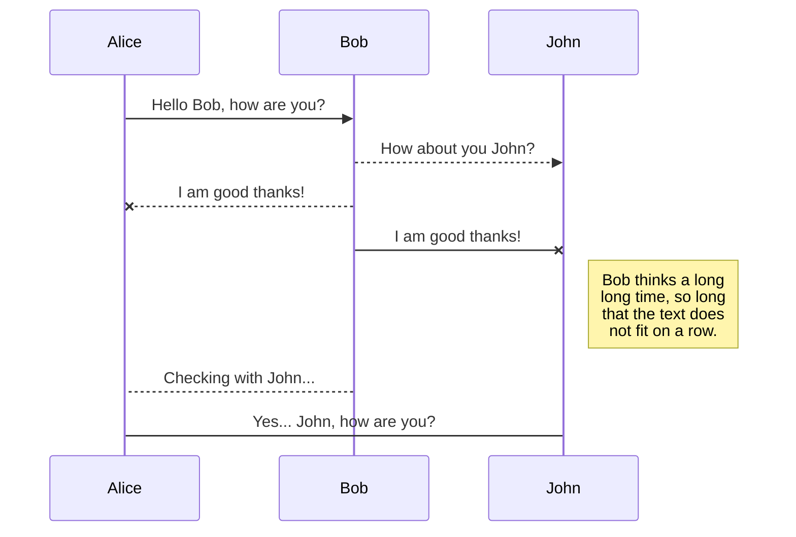
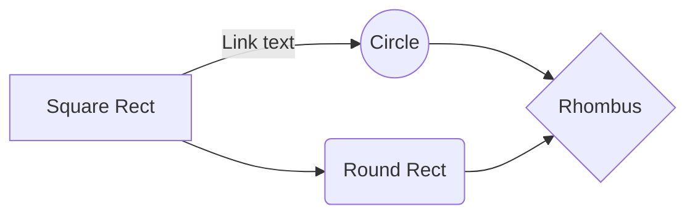
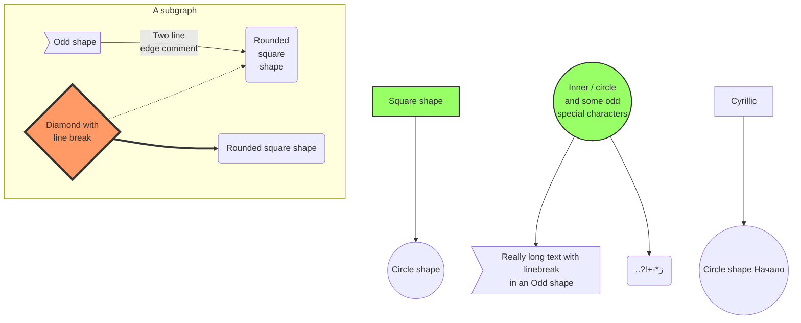
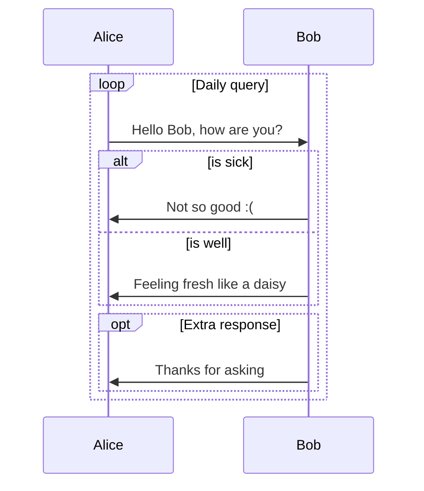

Many problems in scientific computing require calculating the function value of function $y = f(x)$. But calculations are sometimes not so simple:


- Since the computer hardware system can only provide four operations and logical operations such as addition, subtraction, multiplication, and division, the vast majority of functions cannot be directly calculated by computers.

- Sometimes although the expression of a function is known, the calculation of the value of the function cannot be done by a finite number of four operations

- Some functions, although they exist, can only give their function values at discrete points, but cannot give their analytic expressions

Therefore, it is necessary to construct an approximate function for the function $y = f(x)$ that is easy to calculate on the computer, and use the approximate function instead of the function $y = f(x)$ for numerical operations, which is the numerical approximation problem.

# Interpolation

The interpolation method is a simple but important method in numerical analysis, which can be used to calculate the approximate function of the function value at a finite point, and then calculate the value of the function at other points.

The interpolation method plays an important role in discrete data processing, approximate representation of functions, numerical differentiation, numerical integration, and the generation of curves and surfaces.

We first introduce the basic definition and interpolation format of interpolation, and then introduce three polynomial interpolation methods, namely Lagrange interpolation, Newton interpolation, and Hermite interpolation.


> Let the function value and derivative of the function be known at n points of mutual difference
> $$ 
> f(x_1) , f'(x_1) , \dots , f^{\alpha_1 - 1}(x_1)
> $$
> $$ 
> f(x_2) , f'(x_2) , \dots , f^{\alpha_2 - 1}(x_2)
> $$
> $$ 
> \vdots \qquad\qquad \vdots
> $$
> $$ 
> f(x_n) , f'(x_n) , \dots , f^{\alpha_n - 1}(x_n)
> $$
> Construct a simple and easy-to-calculate function p(x) that satisfies the following conditions:
> $$ 
> p^{(\mu_i)}(x_i) = f^{(\mu_i)}(x_i) , i = 1,2,\dots,n;  \mu_i = 0,1,\dots,\alpha_i-1
> $$
> The above problem is called the interpolation problem. $ x_1 , x_2 , \dots , x_n $ is called interpolation nodes.
> $p(x)$ is called an interpolation function of $f(x)$ with respect to the nodes group, and the condition is called the interpolation condition.

It is understood geometrically, as shown in the figure below:


$p(x)$ is an interpolated polynomial function of $f(x)$ that we calculate and passes through the given pairs of data: 

$$ 
\{ (x_1,f(x_1) , (x_2,f(x_2)) , \dots , (x_n,f(x_n)) \}
$$

In this way, if there are new data points $x_{n+1}$ , p(x) is substituted directly to predict what the specific value should be.

In simple terms, the basic idea of interpolation is:


1. Conditions that need to be met for a simple function class base
2. Give a specific function base
3. Calculate the coefficients

Suppose $f(x)$ is an unknown or complex function defined on the interval $[a,b]$, but the function value of the function at the point of difference $ x_1 , x_2 , \dots , x_n $ is known : $ f(x_1) , f(x_2) , \dots , f(x_n) $

The goal is to find a function 

$$ 
p(x) = \sum_{k=1}^n c_k\varphi_k(x)
$$ 

in a simple function class:

$$ 
Span \{\varphi_1,\varphi_2,\dots,\varphi_n\} \subset C[a,b]
$$

that satisfies the condition:

$$ 
p(x_i) = f(x_i), \quad i =1,2,\dots,n 
$$

That is, at a given point, $p(x)$ coincides with $f(x)$.

When we see the structure as: $ p_n(x) = \sum_{k=1}^n c_k\varphi_k(x)$, it can be imagined that we can use the solution method of the system of linear equations to solve.

Then the interpolation problem is equivalent to solving a system of equations:

$$ 
p(x_i) = \sum_{k=1}^n c_k\varphi_k(x_i) = f(x_i), \quad i =1,2,\dots,n 
$$

$$
\left(\begin{array}{cccc}
\varphi_1\left(x_1\right) & \varphi_2\left(x_1\right) & \cdots & \varphi_n\left(x_1\right) \\
\varphi_1\left(x_2\right) & \varphi_2\left(x_2\right) & \cdots & \varphi_n\left(x_2\right) \\
\vdots & \vdots & \ddots & \vdots \\
\varphi_1\left(x_n\right) & \varphi_2\left(x_n\right) & \cdots & \varphi_n\left(x_n\right)
\end{array}\right)\left(\begin{array}{c}
c_1 \\
c_2 \\
\vdots \\
c_n
\end{array}\right)=\left(\begin{array}{c}
f\left(x_1\right) \\
f\left(x_2\right) \\
\vdots \\
f\left(\x_n\right)
\end{array}\right)
$$

But we all know that a system of linear equations does not necessarily have a solution, and certain conditions need to be met:

> The Haar condition for the existence of solutions
> Let $\varphi_1(x), \varphi_2(x), \cdots, \varphi_n(x)$ are the functions on $[a, b]$ , and for any n distinct points $x_1, x_2, \cdots, x_n$ on the interval $[a, b]$ , determinant:
> $$
> \left|\begin{array}{cccc}
> \varphi_1\left(x_1\right) & \varphi_2\left(x_1\right) & \cdots & \varphi_n\left(x_1\right) \\
> \varphi_1\left(x_2\right) & \varphi_2\left(x_2\right) & \cdots & \varphi_n\left(x_2\right) \\
> \vdots & \vdots & \ddots & \vdots \\
> \varphi_1\left(x_n\right) & \varphi_2\left(x_n\right) & \cdots & \varphi_n\left(x_n\right)
> \end{array}\right| \neq 0
> $$
> Then we call $\varphi_1(x), \varphi_2(x), \cdots, \varphi_n(x)$ satisfy the Haar condition on the interval $[a, b]$. 

Next we can define the interpolation basis function:

> Interpolation basis function
> Functions $\{l_1(x),l_2(x),\dots,l_n(x)\}$, satisfy:
> $$
> l_k\left(x_i\right)=\delta_{i, k}=\left\{\begin{array}{l}
> 1, i=k, \\
> 0, i \neq k,
> \end{array} \quad k=1, \cdots, n ; i=1, \cdots, n .\right.
> $$
> then, $l_i(x)$ is called interpolation basis function.

The interpolation basis function, which is unknown in our definition at this point, is the form of the hypothesis that we want the result of $p(x)$ to be the same as $f(x)$ for each known point $x_i$.

Then we have this basic idea, which we think is for the function $l_k(x_i)$. When k = i we want $l_k(x_i) = 1$, so that we get $y_i = f(x_i)$ meet our needs, otherwise equal to zero.


# Highlights

*This is italic.* **This is Bold**. * If asterisk is surrounded by spaces, it is not parsed. *

_This is also italic._ __This is also Bold__. _ If underscore is surrounded by spaces, it is not parsed. _

~~This is strike through~~. 

There is no underline in markdown. You can use html tags <u>like this to underline.</u>

`This is a code block`. 

[This is an external link](https://bit.ly). "https://" is important. This is an internal [link](#this-is-a-h2). Internal links are all lowercase with space replaced by hyphens "-". 

You can mix them like [*this*](https://bit.ly), [`this`](https://bit.ly), **[this](https://bit.ly)**, but not like `[this](https://bit.ly)`.

# Blocks


```python
 import numpy as np
 print("""This is a python code fence""")
```

```fortran
 "This is a fortran code fence"
 implicit none
```

```
 This is a simple code fence. You can use it to display text. The fonts are mono spaced.
```

You can mix them as well, like 

> ```
>  This
> ```

# Other Elements

This is horizontal line

------

# Math Blocks

This is inline math $\sum_{i=1}^{N} i $. This is display math.
$$
\sum_{i=1}^{N} i 
$$
The extra empty line matters, or you will end up with
$$
\sum_{i=1}^{N} i
$$
[Mathjax](http://docs.mathjax.org/en/latest/tex.html) syntax is like latex. You cannot use `\usepackge`, but you can use `\newcommand` like this 
$$
\newcommand{\NewOp}[2]{\lbrace{#1}\mid \otimes{#2}\rbrace}
$$
And `\NewOp` will be available in all later math blocks, whether inline $\NewOp{x}{y}$ or display
$$
\NewOp{x}{y}
$$
Be **very careful** with the vertical bar symbol and underscore in math. If you use it like $|x|\ge 0$, $|0|=0$, or like $\lbrace x | x\gt 0\rbrace$, you will get a bunch of gibberish.

Use `\vert` in $\vert x\vert\ge 0$, $\vert 0\vert=0$. Use `\mid` in $\lbrace x \mid x\gt 0$ instead.

Also using underscores like this $x_1$, $x_2$, $x_{c_2}^{c_3}$, with $y_{c_2}^{c_3}$, will be processed as _this_.

Wrap underscores with whitespaces like this $x _ 1$, $x _ 2$, $x _ {c _ 2}^{c _ 3}$, with $y _ {c _ 2}^{c _ 3 }$.

# Images

Markdown uses `` to reference pictures, caption is optional. You cannot control the size. 


So I prefer using HTML tags like this:


# Lists


- List can have multiple lines

  like this.

------


------

1. You can avoid numbers like this
   1. sub item
1. It keeps going
1. Blah Blah


# mermaid










# Tables

| This column is left aligned | This column is centered | This column is right aligned |
| :-------------------------- | :---------------------: | ---------------------------: |
| 1                           |            4            |                            7 |
| 2                           |            5            |                            8 |
| 3                           |            6            |                            9 |

| You can use `` in tables.                    | You can use Math in tables. | You can use `` in tables.               |
| ------------------------------------------------------------ | --------------------------- | ------------------------------------------------------------ |
|  | $1+1=2$                     |  |

# Foot Notes

This is a note[^1]. Footnotes can have captions like[^this]. You can reference to the same note multiple times like[^this]. Foot notes can have many other options like[^this-one]. Or just like [^that]. This is a [reference style link][linkid] to a page. And [this][linkid] is also a link. As is [this][] and [that].

# Titles

# This is  h1

## This is  h2

### This is  h3

#### This is  h4

# Foot Notes

The Foot notes are like this

[^1]: https://ssskz.github.io
[^this]: https://ssskz.github.io
[^this-one]: 

```
> Blockquotes can be in a footnote.
```

```
    as well as code blocks
```

[^that]: or, naturally, simple paragraphs.

[linkid]: https://ssskz.github.io	"Optional Title"
